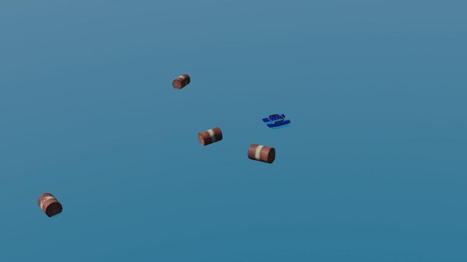

# BlueBoat USV

BlueBoat is an autonomous surface vehicle (ASV/USV) simulation based on the Blue Robotics BlueBoat platform. This example demonstrates maritime robotics control using MATLAB/Simulink with Webots simulation.



## Simulation Videos


---

## Overview

| Property | Value |
|----------|-------|
| **Type** | Unmanned Surface Vehicle (USV) |
| **Propulsion** | Dual thruster (differential) |
| **Sensors** | IMU, GPS, IR distance sensors |
| **Control** | MATLAB/Simulink |
| **Environment** | Ocean simulation with fluid dynamics |

---

## Features

- **Dual Propeller System**: Left and right thrusters for differential steering
- **Ocean Simulation**: Realistic water physics with drag and buoyancy
- **IMU Sensor Suite**: Accelerometer, gyroscope, and inertial unit
- **GPS Navigation**: Position feedback for waypoint following
- **IR Obstacle Detection**: Left and right infrared distance sensors
- **Custom PROTO**: Fully customizable robot definition

---

## Project Structure

```
blueboat_usv/
├── controllers/
│   └── simulink_control_app/
│       ├── simulink_control_app.m        # Main MATLAB controller
│       ├── simulink_control.slx          # Simulink control model
│       ├── state_space_modeling.slx      # State-space model
│       ├── wb_motor_set_velocity.m       # Motor velocity control
│       ├── wb_motor_set_position.m       # Motor position control
│       ├── wb_motor_set_torque.m         # Motor torque control
│       ├── wb_gyro_get_values.m          # Gyroscope reading
│       ├── wb_accelerometer_get_values.m # Accelerometer reading
│       ├── wb_distance_sensor_get_value.m
│       ├── wb_inertial_unit_get_roll_pitch_yaw.m
│       └── wb_robot_step.m               # Simulation step
├── protos/
│   ├── BlueBoat.proto                    # Robot PROTO definition
│   ├── docs/
│   │   └── blueboat.md                   # Proto documentation
│   └── icons/
│       └── BlueBoat.png                  # Robot icon
├── stl/
│   ├── bar.stl                           # Cross bar mesh
│   ├── bracket_bar.stl                   # Bracket mesh
│   ├── crosstube.stl                     # Cross tube mesh
│   ├── left_hull.stl                     # Left hull mesh
│   └── right_hull.stl                    # Right hull mesh
└── worlds/
    └── ocean.wbt                         # Webots world file
```

---

## Specifications

### Physical Properties

| Property | Value |
|----------|-------|
| Hull Type | Catamaran (dual hull) |
| Physics Density | 400 kg/m³ |
| Drag Coefficient | 0.01 (linear) |
| Viscous Resistance | 400 |
| Damping | 0.5 (linear), 0.5 (angular) |

### Propulsion

| Motor | Name | Max Velocity |
|-------|------|--------------|
| Left Thruster | `left_motor` | 30 rad/s |
| Right Thruster | `right_motor` | 30 rad/s |

### Sensors

| Sensor | Webots Name | Purpose |
|--------|-------------|---------|
| Accelerometer | `accelerometer` | Linear acceleration (3-axis) |
| Gyroscope | `gyro` | Angular velocity (3-axis) |
| GPS | `gps` | Global position |
| Inertial Unit | `inertial_unit` | Roll, pitch, yaw |
| Left IR | `left_ir` | Left obstacle detection |
| Right IR | `right_ir` | Right obstacle detection |

---

## Controller Implementation

### Initialization

```matlab
% simulink_control_app.m
TIME_STEP = 16;

% Filter coefficients for sensor smoothing
alpha_pitch = 0.85;
alpha_roll = 0.85;
alpha_yaw = 0.85;

% Initialize IMU sensors
accelerometer_sensor = wb_robot_get_device('accelerometer');
wb_accelerometer_enable(accelerometer_sensor, TIME_STEP);

gyro_sensor = wb_robot_get_device('gyro');
wb_gyro_enable(gyro_sensor, TIME_STEP);

gps_sensor = wb_robot_get_device('gps');
wb_gps_enable(gps_sensor, TIME_STEP);

% Initialize distance sensors
left_IR = wb_robot_get_device('left_ir');
right_IR = wb_robot_get_device('right_ir');
wb_distance_sensor_enable(left_IR, TIME_STEP);
wb_distance_sensor_enable(right_IR, TIME_STEP);

% Initialize inertial unit
inertial_unit = wb_robot_get_device('inertial_unit');
wb_inertial_unit_enable(inertial_unit, TIME_STEP);

% Initialize motors
left_thruster_motor = wb_robot_get_device('left_motor');
right_thruster_motor = wb_robot_get_device('right_motor');

% Load Simulink model
open_system('simulink_control');
load_system('simulink_control');
```

### Differential Thrust Control

```matlab
% Compute motor commands from desired linear and angular velocity
function [v_left, v_right] = differential_thrust(v_linear, v_angular, L)
    % L = distance between thrusters
    v_left = v_linear - (v_angular * L / 2);
    v_right = v_linear + (v_angular * L / 2);
end
```

---

## Control Strategies

### Heading Control (Yaw)

```matlab
% PID heading controller
Kp_yaw = 2.0;
Ki_yaw = 0.1;
Kd_yaw = 0.5;

yaw_error = desired_heading - current_yaw;
yaw_control = Kp_yaw * yaw_error + Ki_yaw * yaw_integral + Kd_yaw * yaw_derivative;

% Apply differential thrust
left_thrust = base_thrust - yaw_control;
right_thrust = base_thrust + yaw_control;
```

### Waypoint Navigation

```matlab
% Navigate to GPS waypoint
function [v, omega] = waypoint_control(current_pos, target_pos, current_heading)
    % Compute bearing to target
    dx = target_pos(1) - current_pos(1);
    dy = target_pos(2) - current_pos(2);
    target_bearing = atan2(dy, dx);

    % Distance to target
    distance = sqrt(dx^2 + dy^2);

    % Heading error
    heading_error = target_bearing - current_heading;
    heading_error = atan2(sin(heading_error), cos(heading_error));  % Normalize

    % Control outputs
    v = min(max_speed, Kp_distance * distance);
    omega = Kp_heading * heading_error;
end
```

---

## Fluid Dynamics

The BlueBoat PROTO includes realistic hydrodynamic properties:

```
immersionProperties [
  ImmersionProperties {
    fluidName "fluid"
    dragForceCoefficients 0.01 0 0
    dragTorqueCoefficients 0.05 0 0
    viscousResistanceForceCoefficient 400
    viscousResistanceTorqueCoefficient 0.1
  }
]
```

These parameters affect:
- **Drag Force**: Resistance to linear motion
- **Drag Torque**: Resistance to rotation
- **Viscous Resistance**: Water friction effects

---

## Quick Start

1. **Open Webots** and load `examples/blueboat_usv/worlds/ocean.wbt`

2. **Start MATLAB** and ensure Webots library is in the path

3. **Run the simulation**:
   - The BlueBoat will initialize sensors and motors
   - Simulink model provides control signals
   - Observe navigation behavior on the ocean surface

4. **Customize control**:
   - Modify `simulink_control.slx` for different control strategies
   - Adjust PID gains for desired response
   - Add waypoint sequences for autonomous missions

---

## Applications

- **Environmental Monitoring**: Water quality sensing
- **Surveillance**: Maritime patrol and observation
- **Research**: Oceanographic data collection
- **Education**: Marine robotics and control systems

---

## References

- [Blue Robotics BlueBoat](https://bluerobotics.com/store/boat/blueboat/blueboat/)
- [Webots Fluid Simulation](https://cyberbotics.com/doc/reference/fluid)
- [Marine Vehicle Dynamics - Fossen](https://www.wiley.com/en-us/Handbook+of+Marine+Craft+Hydrodynamics+and+Motion+Control-p-9781119991496)
